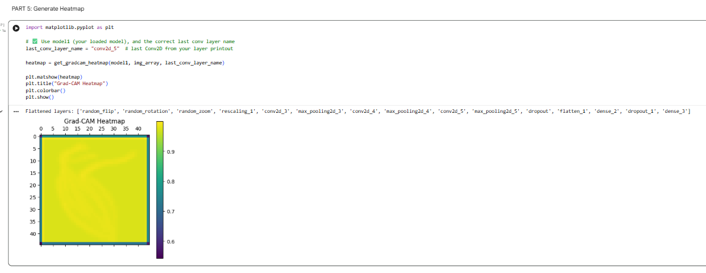
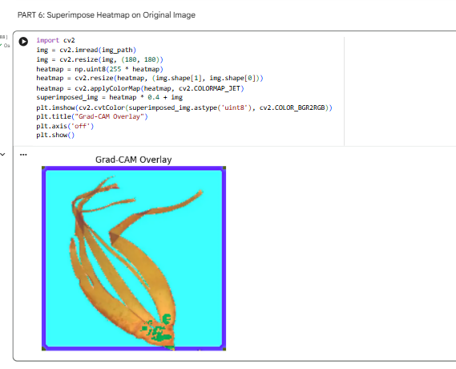

# LW4_Improving-CNN-Performance

Google Colab (https://colab.research.google.com/drive/11TM5mp2acsh3iTxDYLvDhhXVIExGI4i3?usp=sharing)

# **GUIDE QUESTIONS (Student Explanation & Reflection)**

## **A. Model Evaluation Analysis**

**1. What were the weakest-performing classes based on the confusion matrix?**
**ANS:** Based on my SeaWeeds 20 Categories, the weakest-performing classes are:

* Chaetomorpha (40)
* CladophoraRupestris (40)
* CodiumFragile (44)

---

**2. How did Precision, Recall, and F1-score vary across classes?**
**ANS:** Precision, Recall, and F1-score are identical (1.00) for all classes, meaning there are no differences between them.

---

**3. What does a low recall indicate in your model?**
**ANS:** However in this case recall is 1.00 for all classes, so the model does not miss any instances

---

**4. How does AUC score reflect model performance compared to accuracy?**
**ANS:** AUC (Area Under the ROC Curve) reflects model performance by measuring how well the model can distinguish between classes across all possible thresholds, while accuracy measures the percentage of correct predictions at a single threshold. So accuracy shows how often the model is correct, whereas AUC shows how well the model separates classes regardless of threshold

---

## **B. Model Improvement**

**5. How did data augmentation affect validation accuracy?**
**ANS:** At the beginning, the validation accuracy was very low (around 0.1) but after applying data augmentation, it rapidly increased within the first few epochs and reached close to 1.0 (100%). It then remained stable and closely followed the training accuracy. Data augmentation improved validation accuracy by increasing it from very low values to nearly 100% and stabilizing performance, showing better generalization.

---

**6. Why is Batch Normalization important in CNNs?**
**ANS:** Batch Normalization is important in CNNs because it stabilizes and speeds up the training process by normalizing the inputs of each layer. It reduces the problem of changing data distributions during training (called internal covariate shift), allowing the network to learn more efficiently.

---

**7. What role did Dropout play in improving your model?**
**ANS:** Dropout helps prevent overfitting by randomly disabling neurons during training. As a result, it reduces overfitting, improves generalization to validation/test data, and makes the model less sensitive to noise.

---

**8. How did Early Stopping prevent overfitting?**
**ANS:** During training, the model keeps learning patterns from the training data. After a certain point it may start memorizing the data instead of generalizing this is overfitting. Early Stopping monitors the validation loss or accuracy and halts training when it begins to worsen or no longer improves.

---

## **C. Performance Comparison**

**9. What improvements were observed after modifying the model?**
**ANS:** After modifying the model, significant improvements were observed in both performance and training behavior. The model achieved near-perfect results, with validation accuracy increasing to almost 100%, and loss values dropping close to zero. The training and validation curves also became closely aligned, indicating better generalization and reduced overfitting. Additionally, performance metrics such as precision, recall, F1-score, and AUC all reached very high values, showing that the model can accurately classify across all classes.

---

**10. Which enhancement contributed the most to performance improvement? Why?**
**ANS:** data augmentation.
Why?
Your validation accuracy jumped dramatically from very low to nearly 100% right after applying augmentation. That kind of improvement usually comes from giving the model more diverse and realistic training data, not just tweaking the architecture.

---

**11. Did the gap between training and validation accuracy decrease? Explain.**
**ANS:** Yes 
 The gap between training and validation accuracy decreased. This means the model performed more similarly on both training and validation data. It suggests that overfitting was reduced, and the model became better at generalizing to unseen data instead of only memorizing the training data.

---

## **D. Explainability (Grad-CAM Integration)**

**12. How did Grad-CAM help in understanding model predictions?**
**ANS:** Grad-CAM helped by showing which parts of the image the model focused on when making a prediction. It produces a heatmap that highlights important regions that influenced the decision. This makes it easier to understand whether the model is looking at the correct features or not.it helps us see why the model made a certain prediction and improves interpretability of the CNN model.

---

**13. Did the improved model focus on more relevant regions? Provide evidence.**
**ANS:** Yes, based on my Grad-CAM result (OARWEED), the model focuses more on the important parts of the image. The highlighted regions show that it is now paying attention to the object instead of irrelevant background areas.

## Grad-CAM Results

### Heatmap

### Overlay

---

**14. Why is explainability important in real-world AI applications?**
**ANS:** Explainability is important in real-world AI because it helps us understand how the model makes decisions. It allows users to know why a prediction is made instead of just accepting the result. This is important for trust, especially in areas like healthcare and finance. It also helps developers check errors and improve the model’s performance.

